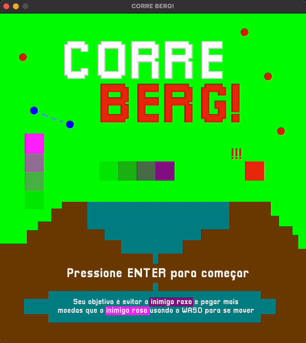
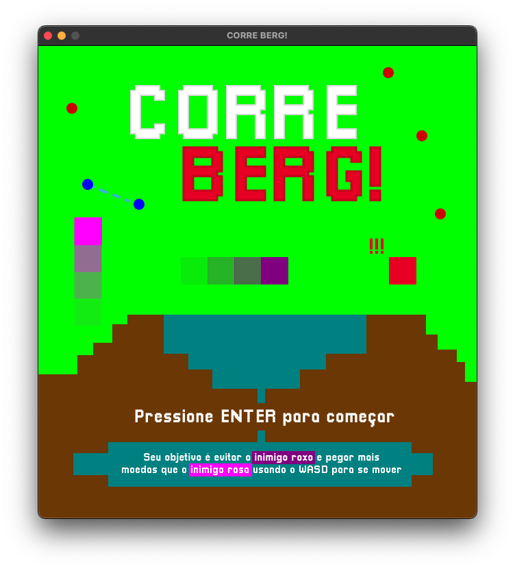
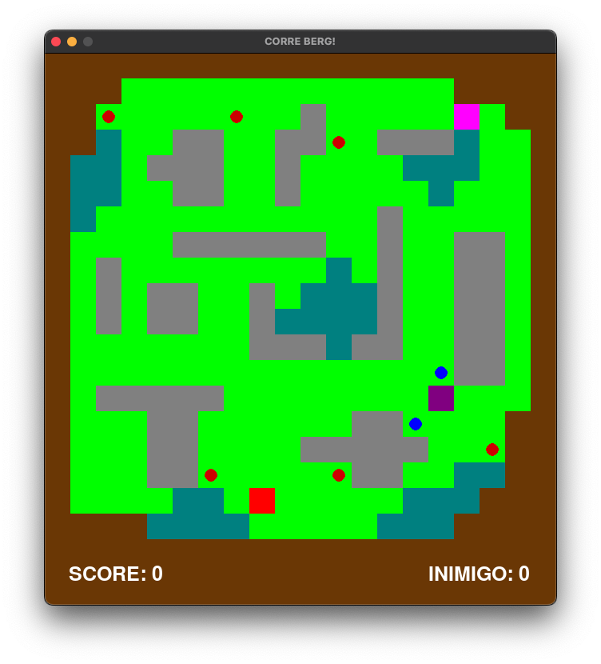
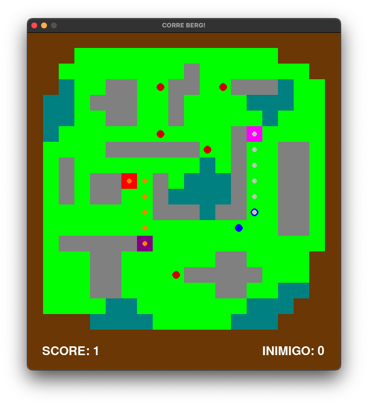
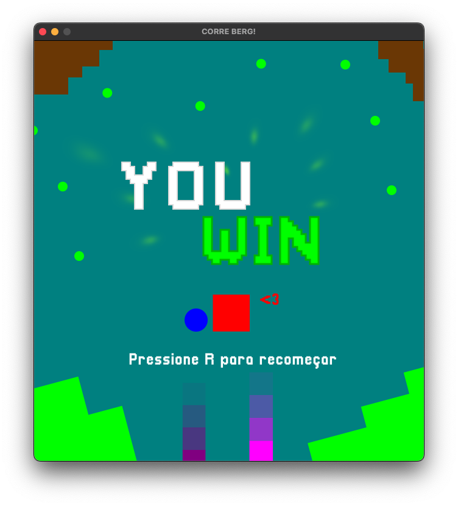
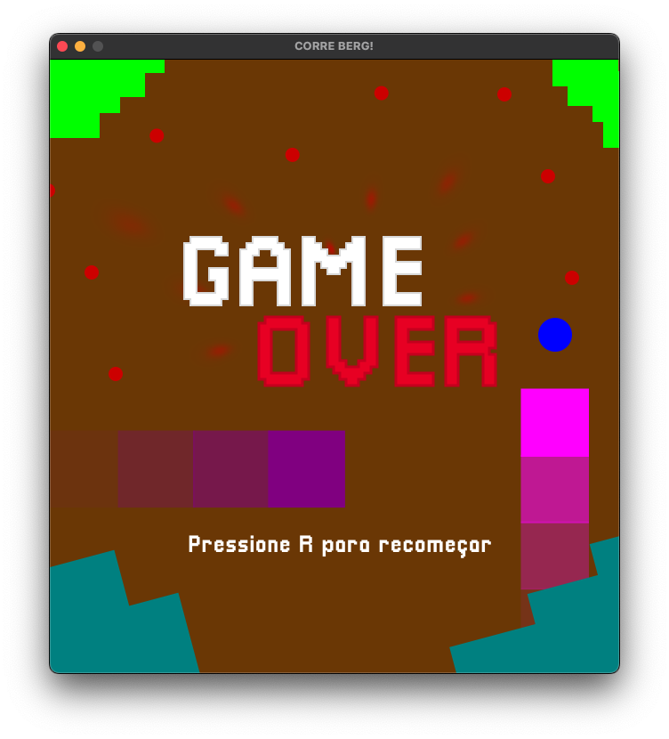

# :red_square: Corre Berg! :large_blue_circle: :large_blue_circle:     :red_circle:          :red_circle:

**Número da Lista**: Dupla 3<br>
**Conteúdo da Disciplina**: Final<br>

## Alunos 
|Matrícula | Aluno |
| -- | -- |
| 19/0089792  |  João Victor Correia de Oliveira |
| 19/0020601  |  Victor Buendia Cruz de Alvim |

## Sobre 
**Berg** :red_square: é um quadradinho mágico que aceitou o desafio de ser o melhor corredor do mundo das matrizes, por isso ele precisa coletar a maior quantidade de moedas (em vermelho ou azul) :red_circle: :large_blue_circle: possíveis no mapa. Porém, como todo bom desafio, Berg precisa passar pelas pedras no caminho, ou melhor, *evitá-las*, pois no mapa ele não pode correr sobre elas. Piorando sua situação, Berg possui dois inimigos que vão lhe atrapalhar: **Bob**, um quadrado rosa, que vai tentar roubar as moedas mais próximas :large_blue_circle: (marcadas em azul) e **Bill**, um quadrado roxo, que irá persegui-lo pelo menor caminho e, caso consiga alcançá-lo, irá imobilizá-lo. Tenha cuidado, porque Bob fica mais rápido a cada moeda que ele coleta! Além disso, a cada moeda que o Berg pega, o Bob corre MAIS RÁPIDO AINDAAA!!!! Então, se você vacilar, o Berg vai precisar CORRER MUITO!!!!

Sua missão como jogador é ajudar Berg nessa missão superando seus adversários, coletando mais moedas que o inimigo até que elas se acabem no jogo.

Para iniciar o jogo, aperte **ENTER/RETURN** para começar. Depois disso, um countdown de 5 segundos se inicia para você ver as moedas no mapa e a posição dos inimigos e planejar sua melhor rota para vencer.

Para recomeçar, basta apertar **R**.

### :bulb: BÔNUS!!
Você pode apertar **C** para visualizar o caminho que o Bob (que te persegue) e o Bill (que persegue as moedas) vão fazer usando o A-Star.

Você também pode apertar **M** para ver o mapa com uma malha quadriculada caso ache melhor a visualização.

### CONTEÚDOS APLICADOS UTILIZADOS:

* Grafos: O mapa quadriculado do jogo é composto de objetos *célula* que formam um grafo armazenado em formato matricial.
  
* Par de Pontos mais próximos e Distância Manhattan (Dividir e Conquistar): Para melhorar a estratégia de Bob, ele sempre verificará quais as duas moedas que estão mais próximas no mapa, utilizando o algoritmo de par de pontos mais próximos, e pegará a mais próxima de si, utilizando o cálculo da Distância de Manhattan. Aqui utilizamos Dividir e Conquistar.

* A-Star (Programação Dinâmica): Bill perseguirá Berg pelo menor caminho com o menor preço dentro do grafo que representa o nosso mapa calculado pelo algoritmo de Programação Dinâmica A-Star. Dessa forma, o mapa possui as pedras e areias (que são incaminháveis pelo jogador e muito caras para os inimigos) e a grama e água (na qual a grama é mais barata que a água para caminhar para os inimigos). Além disso, Bob também vai atrás das suas moedas utilizando o mesmo algoritmo.


## Screenshots













## Vídeo de Apresentação


## Instalação 
**Linguagem**: Python<br>
**Framework**: Pygame <br>
Necessário ter o [Python](https://www.python.org/downloads/) instalado.

## Uso 
Para rodar o projeto abra o terminal e execute o seguinte comandos:

```
python3 -m venv .pv
source .pv/bin/activate
pip3 install -r requirements.txt
python3 src/main.py
```